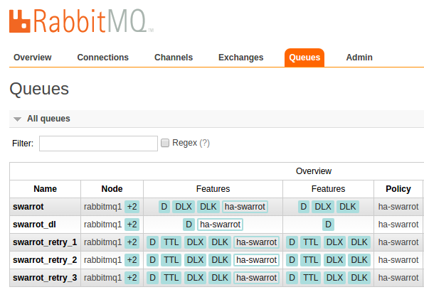

# Docker Rabbitmq HA Cluster

A docker stack to create, test and benchmark a rabbitmq cluster in high availability configuration:

* HAProxy
* Three nodes cluster
* Persistent messages
* Durable and mirrored exchanges
* Durable and mirrored queues
* HA custom policy
* Parallel producers
* Parallel consumers


## The stack

A lot of great tools (thanks to all awesome authors)

* Make
* Docker and docker-compose
* Rabbitmq and Management Plugin (docker)
* HAProxy (docker)
* Shell scripts
* Symfony MicroFramework (producers and consumers in docker containers)
* swarrot/swarrot-bundle
* php-amqplib/rabbitmq-bundle
* odolbeau/rabbit-mq-admin-toolkit

## Tests / Benchmark

With this stack you will be able to experiment:

* Load Balancing
* Node failure
* Network partition
* Messages persistency
* Message NO ACK and retries

## Setup / Start /Stop the cluster

```shell
make install
make start
make stop
```

Once the setup process is over, check everything is ok (sometimes the startup process fails):

```
make stop && make start # To restart the cluster properly
```

```shell
$ make state
== Print state of containers ==
            Name                           Command               State                                                          Ports                                                         
---------------------------------------------------------------------------------------------------------------------------------------------------------------------------------------------
rabbitmqbenchmark_haproxy_1     /sbin/tini -- dockercloud- ...   Up      1936/tcp, 443/tcp, 0.0.0.0:5672->5672/tcp, 0.0.0.0:80->80/tcp                                                        
rabbitmqbenchmark_rabbitmq1_1   /pre-entrypoint.sh rabbitm ...   Up      127.0.0.1:1234->15672/tcp, 25672/tcp, 4369/tcp, 5672/tcp, 9100/tcp, 9101/tcp, 9102/tcp, 9103/tcp, 9104/tcp, 9105/tcp 
rabbitmqbenchmark_rabbitmq2_1   /pre-entrypoint.sh rabbitm ...   Up      127.0.0.1:1235->15672/tcp, 25672/tcp, 4369/tcp, 5672/tcp, 9100/tcp, 9101/tcp, 9102/tcp, 9103/tcp, 9104/tcp, 9105/tcp 
rabbitmqbenchmark_rabbitmq3_1   /pre-entrypoint.sh rabbitm ...   Up      127.0.0.1:1236->15672/tcp, 25672/tcp, 4369/tcp, 5672/tcp, 9100/tcp, 9101/tcp, 9102/tcp, 9103/tcp, 9104/tcp, 9105/tcp
```

Access the Management Plugin interface for nodes:

* http://127.0.0.1:1234
* http://127.0.0.1:1235
* http://127.0.0.1:1236


You can use, test or compare two php/symfony librairies.
Simply use one of the library or both in the mean time.

### Swarrot/SwarrotBundle

#### Set the ha-policy

```shell
$ make cluster-sw 
== SWARROT Rabbit Clustering ==
Setting policy "ha-swarrot" for pattern "^swarrot" to " {\"ha-mode\":\"all\",\"ha-sync-mode\":\"automatic\"}" with priority "0" ...
```


#### Excnahges/Queues

With Swarrot, exchanges and queues are not created by the library or the bundle.
YOu need to create everything manually or with command line.

```shell
$ make init-sw 
== Rabbit init ==
IMPORTANT : Waiting for nothing because no  env var defined !!!
With DL: false
With Unroutable: false
Create exchange swarrot
Create exchange dl
Create queue swarrot
Create queue swarrot_dl
Create binding between exchange dl and queue swarrot_dl (with routing_key: swarrot)
Create exchange retry
Create queue swarrot_retry_1
Create binding between exchange retry and queue swarrot_retry_1 (with routing_key: swarrot_retry_1)
Create binding between exchange retry and queue swarrot (with routing_key: swarrot)
Create exchange retry
Create queue swarrot_retry_2
Create binding between exchange retry and queue swarrot_retry_2 (with routing_key: swarrot_retry_2)
Create binding between exchange retry and queue swarrot (with routing_key: swarrot)
Create exchange retry
Create queue swarrot_retry_3
Create binding between exchange retry and queue swarrot_retry_3 (with routing_key: swarrot_retry_3)
Create binding between exchange retry and queue swarrot (with routing_key: swarrot)
Create binding between exchange swarrot and queue swarrot (with routing_key: swarrot)
```


**HA Policy**



#### Consumers

```shell
$ make bash
== Connect into PHP container ==
IMPORTANT : Waiting for nothing because no  env var defined !!!
bash-4.3# ./consume.sh 
---------------------------------------------------
> Type: swarrot
> Info: 30 consumers running in parallel reading 100 messages each before finishing
---------------------------------------------------
30 consumers running...
```

#### Producers

```shell
$ make bash
== Connect into PHP container ==
IMPORTANT : Waiting for nothing because no  env var defined !!!
bash-4.3# ./produce.sh 
---------------------------------------------------
> Type: swarrot
> Info: 10 producuers running in parallel
---------------------------------------------------
10 producuers running...
Process 9: 100 more messages added
Process 19: 100 more messages added
Process 28: 100 more messages added
Process 37: 100 more messages added
Process 46: 100 more messages added
Process 55: 100 more messages added
Process 64: 100 more messages added
Process 73: 100 more messages added
Process 82: 100 more messages added
Process 91: 100 more messages added
10 new producuers running...
Process 100: 100 more messages added
Process 109: 100 more messages added
Process 118: 100 more messages added
Process 127: 100 more messages added
```

Once consumers and producers are started you should see messages in the Rabbitmq Management Plugin interface for all nodes.


### php-amqplib/RabbitMqBundle

#### Set the ha-policy

```shell
$ make cluster-os
== SWARROT Rabbit Clustering ==
Setting policy "ha-oldsound" for pattern "^oldsound" to " {\"ha-mode\":\"all\",\"ha-sync-mode\":\"automatic\"}" with priority "0" ...
```


#### Consumers

```shell
$ make bash
== Connect into PHP container ==
IMPORTANT : Waiting for nothing because no  env var defined !!!
bash-4.3# ./consume.sh oldsound
---------------------------------------------------
> Type: oldsound
> Info: 30 consumers running in parallel reading 100 messages each before finishing
---------------------------------------------------
30 consumers running...
```


#### Producers

```shell
$ make bash
== Connect into PHP container ==
IMPORTANT : Waiting for nothing because no  env var defined !!!
bash-4.3# ./produce.sh oldsound
---------------------------------------------------
> Type: oldsound
> Info: 10 producers running in parallel
---------------------------------------------------
10 producers running...
Process 10: 100 more messages added
Process 20: 100 more messages added
Process 29: 100 more messages added
Process 38: 100 more messages added
Process 47: 100 more messages added
Process 56: 100 more messages added
Process 65: 100 more messages added
Process 74: 100 more messages added
Process 86: 100 more messages added
Process 83: 100 more messages added
10 new producers running...
Process 101: 100 more messages added
```

Once consumers and producers are started you should see messages in the Rabbitmq Management Plugin interface for all nodes.


## Tests/Benckmark

### Node failures

#### Stop the first node

#### Stop the second node

#### Restart the first node

#### Stop the third node

#### Restart all nodes

### Network partition
