# Docker Rabbitmq HA Cluster

## TLDR
A docker stack to create, test and benchmark a rabbitmq cluster in high availability configuration:

* HAProxy
* Three nodes cluster
* Persistent messages
* Durable and mirrored exchanges
* Durable and mirrored queues
* HA custom policy
* Parallel producers
* Parallel consumers

If you have questions, comments or suggestions please just create issues.


## The stack


A lot of great tools (thanks to all awesome authors)

* Make
* Docker and docker-compose
* Rabbitmq and Management Plugin (docker)
* [HAProxy](https://github.com/docker/dockercloud-haproxy)
* Shell scripts
* Symfony MicroFramework (producers and consumers in docker containers)
* [swarrot](https://github.com/swarrot/swarrot) / [swarrot-bundle](https://github.com/swarrot/SwarrotBundle)
* [php-amqplib/rabbitmq-bundle](https://github.com/php-amqplib/RabbitMqBundle)
* [odolbeau/rabbit-mq-admin-toolkit](https://github.com/odolbeau/rabbit-mq-admin-toolkit)

## Tests / Benchmark

With this stack you will be able to experiment:

* Load Balancing
* Node failure
* Network partition
* Messages persistency
* Message NO ACK and retries

## Setup / Start /Stop the cluster

```shell
make install
make start
make stop
```

Once the setup process is over, check everything is ok (sometimes the startup process fails):

```
make stop && make start # To restart the cluster properly
```

```shell
$ make state
== Print state of containers ==
    Name                   Command               State                                                          Ports                                                         
-----------------------------------------------------------------------------------------------------------------------------------------------------------------------------
rmq_haproxy_1   /sbin/tini -- dockercloud- ...   Up      1936/tcp, 443/tcp, 0.0.0.0:5672->5672/tcp, 0.0.0.0:80->80/tcp                                                        
rmq_rmq1_1      /pre-entrypoint.sh rabbitm ...   Up      127.0.0.1:1234->15672/tcp, 25672/tcp, 4369/tcp, 5672/tcp, 9100/tcp, 9101/tcp, 9102/tcp, 9103/tcp, 9104/tcp, 9105/tcp 
rmq_rmq2_1      /pre-entrypoint.sh rabbitm ...   Up      127.0.0.1:1235->15672/tcp, 25672/tcp, 4369/tcp, 5672/tcp, 9100/tcp, 9101/tcp, 9102/tcp, 9103/tcp, 9104/tcp, 9105/tcp 
rmq_rmq3_1      /pre-entrypoint.sh rabbitm ...   Up      127.0.0.1:1236->15672/tcp, 25672/tcp, 4369/tcp, 5672/tcp, 9100/tcp, 9101/tcp, 9102/tcp, 9103/tcp, 9104/tcp, 9105/tcp
```

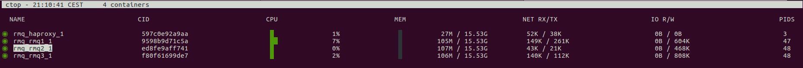

Access the Management Plugin interface for nodes:

* http://127.0.0.1:1234
* http://127.0.0.1:1235
* http://127.0.0.1:1236


You can use, test or compare two php/symfony librairies.
Simply use one of the library or both in the mean time.

### Swarrot/SwarrotBundle

#### Set the ha-policy

```shell
$ make cluster-sw
== SWARROT Rabbit Clustering ==
Setting policy "ha-swarrot" for pattern "^swarrot" to " {\"ha-mode\":\"all\",\"ha-sync-mode\":\"automatic\"}" with priority "0" ...
```

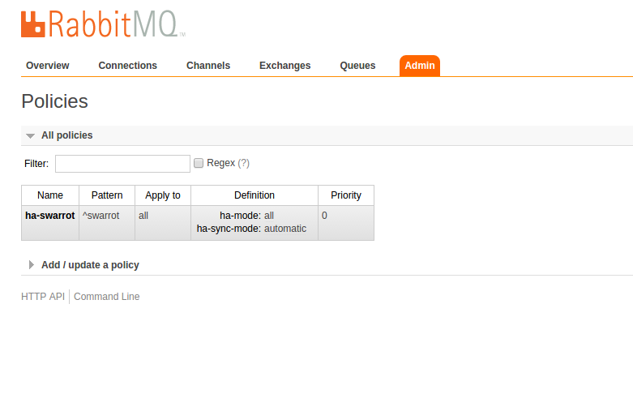

#### Exchanges/Queues

With Swarrot, exchanges and queues are not created by the library or the bundle.
YOu need to create everything manually or with command line.

```shell
$ make init-sw
== Rabbit init ==
IMPORTANT : Waiting for nothing because no  env var defined !!!
With DL: false
With Unroutable: false
Create exchange swarrot
Create exchange dl
Create queue swarrot
Create queue swarrot_dl
Create binding between exchange dl and queue swarrot_dl (with routing_key: swarrot)
Create exchange retry
Create queue swarrot_retry_1
Create binding between exchange retry and queue swarrot_retry_1 (with routing_key: swarrot_retry_1)
Create binding between exchange retry and queue swarrot (with routing_key: swarrot)
Create exchange retry
Create queue swarrot_retry_2
Create binding between exchange retry and queue swarrot_retry_2 (with routing_key: swarrot_retry_2)
Create binding between exchange retry and queue swarrot (with routing_key: swarrot)
Create exchange retry
Create queue swarrot_retry_3
Create binding between exchange retry and queue swarrot_retry_3 (with routing_key: swarrot_retry_3)
Create binding between exchange retry and queue swarrot (with routing_key: swarrot)
Create binding between exchange swarrot and queue swarrot (with routing_key: swarrot)
```

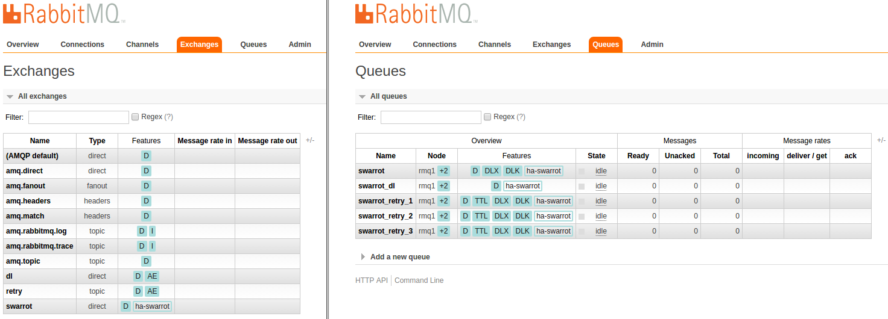


#### Consumers

```shell
$ make bash
== Connect into PHP container ==
IMPORTANT : Waiting for nothing because no  env var defined !!!
bash-4.3# ./consume.sh 
---------------------------------------------------
> Type: swarrot
> Info: 30 consumers running in parallel reading 100 messages each before finishing
---------------------------------------------------
30 consumers running...
```

#### Producers

```shell
$ make bash
== Connect into PHP container ==
IMPORTANT : Waiting for nothing because no  env var defined !!!
bash-4.3# ./produce.sh 
---------------------------------------------------
> Type: swarrot
> Info: 10 producers running in parallel
---------------------------------------------------
10 producers running...
Process 10: 100 more messages added
Process 20: 100 more messages added
Process 29: 100 more messages added
Process 38: 100 more messages added
Process 47: 100 more messages added
Process 56: 100 more messages added
Process 65: 100 more messages added
Process 74: 100 more messages added
Process 83: 100 more messages added
Process 92: 100 more messages added
10 new producers running...
Process 101: 100 more messages added
```

Once consumers and producers are started you should see messages in the Rabbitmq Management Plugin interface for all nodes.

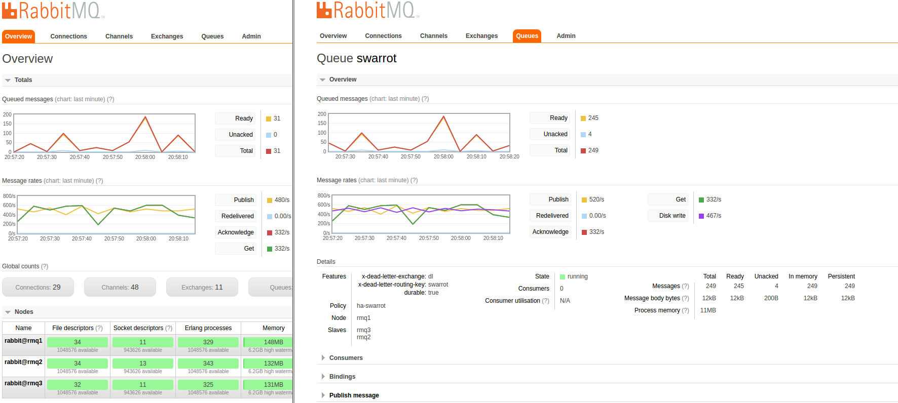

#### Retry

You must use a specific middleware configuration:

```yml
middleware_stack:
    - configurator: swarrot.processor.signal_handler
    - configurator: swarrot.processor.max_messages
      extras:
        max_messages: 100
    - configurator: swarrot.processor.max_execution_time
      extras:
        max_execution_time: 30
    - configurator: swarrot.processor.memory_limit
      extras:
          memory_limit: 50
    - configurator: swarrot.processor.exception_catcher
    - configurator: swarrot.processor.ack
    - configurator: swarrot.processor.retry
      extras:
        retry_exchange: 'retry'
        retry_attempts: 3
        retry_routing_key_pattern: 'swarrot_retry_%%attempt%%'
```

Then you need to throw an exception in the consumer (NO ACK):

```php
    public function process(Message $message, array $options)
    {
        throw new \Exception('NO ACK');
    }
```

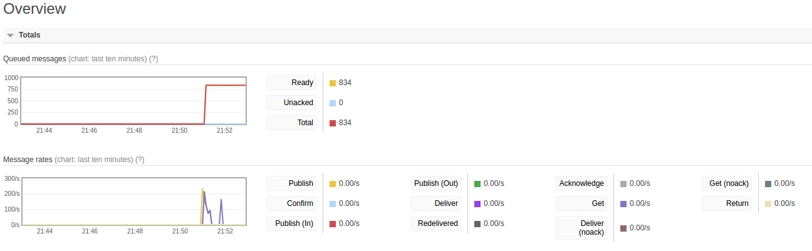

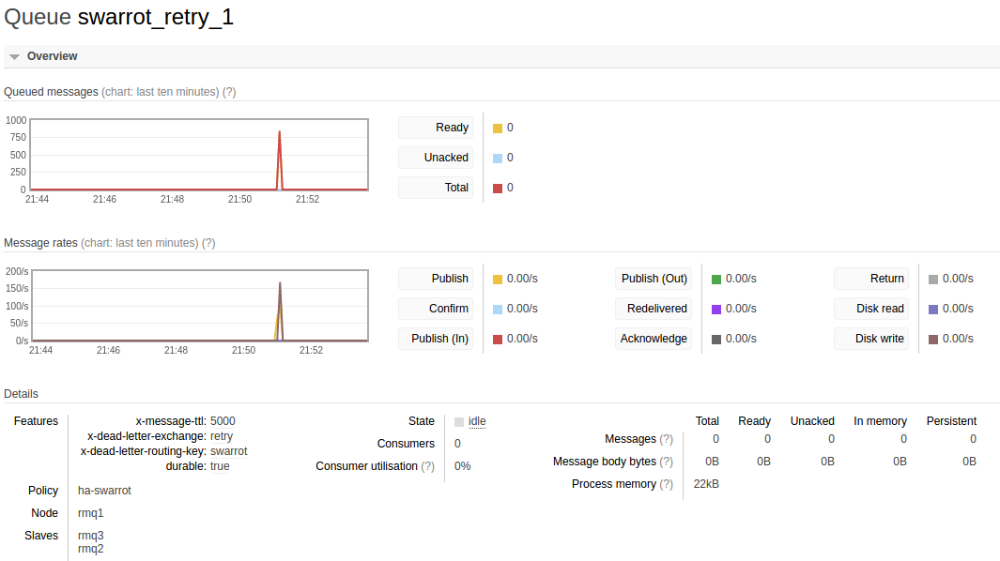

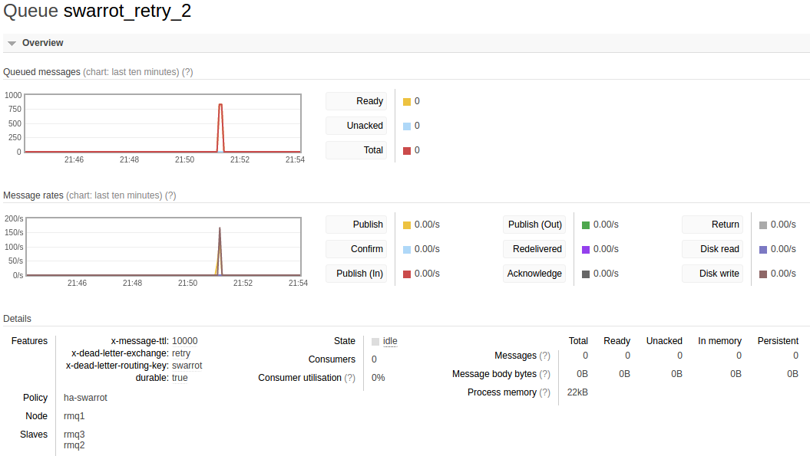

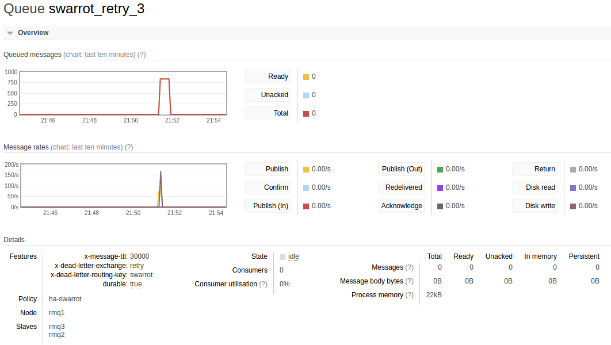

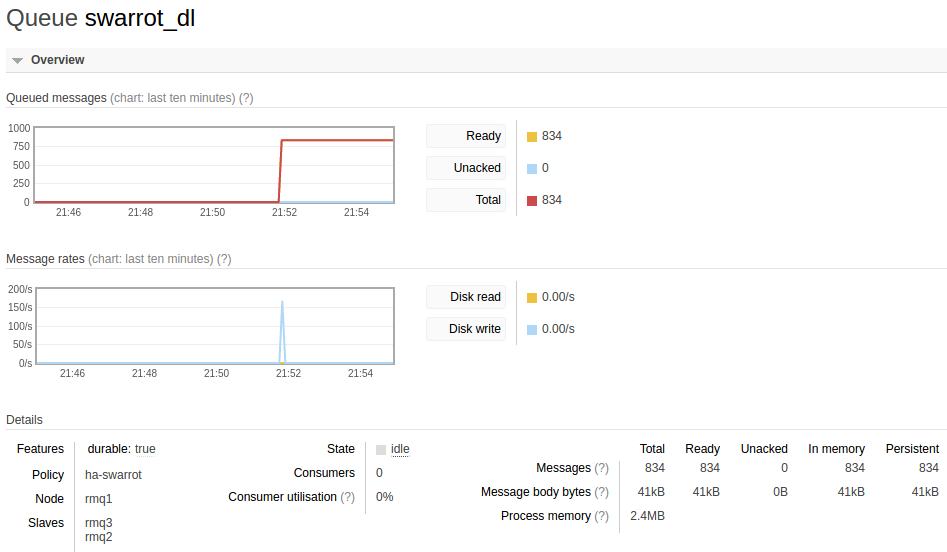


### php-amqplib/RabbitMqBundle

#### Set the ha-policy

```shell
$ make cluster-os
== SWARROT Rabbit Clustering ==
Setting policy "ha-oldsound" for pattern "^oldsound" to " {\"ha-mode\":\"all\",\"ha-sync-mode\":\"automatic\"}" with priority "0" ...
```

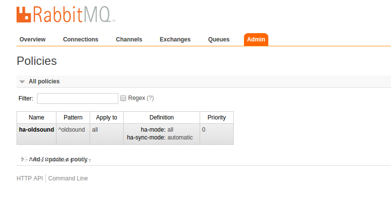

#### Consumers

```shell
$ make bash
== Connect into PHP container ==
IMPORTANT : Waiting for nothing because no  env var defined !!!
bash-4.3# ./consume.sh oldsound
---------------------------------------------------
> Type: oldsound
> Info: 30 consumers running in parallel reading 100 messages each before finishing
---------------------------------------------------
30 consumers running...
```

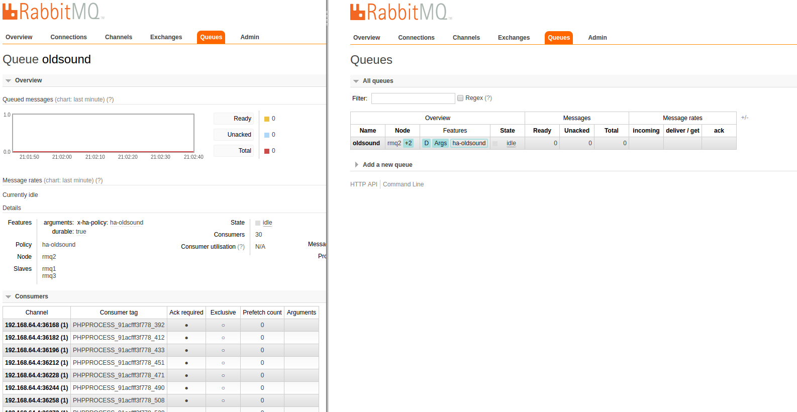

#### Producers

```shell
$ make bash
== Connect into PHP container ==
IMPORTANT : Waiting for nothing because no  env var defined !!!
bash-4.3# ./produce.sh oldsound
---------------------------------------------------
> Type: oldsound
> Info: 10 producers running in parallel
---------------------------------------------------
10 producers running...
Process 582: 100 more messages added
Process 591: 100 more messages added
Process 600: 100 more messages added
Process 609: 100 more messages added
Process 618: 100 more messages added
Process 627: 100 more messages added
Process 636: 100 more messages added
Process 645: 100 more messages added
Process 654: 100 more messages added
Process 663: 100 more messages added
10 new producers running...
```

Once consumers and producers are started you should see messages in the Rabbitmq Management Plugin interface for all nodes.

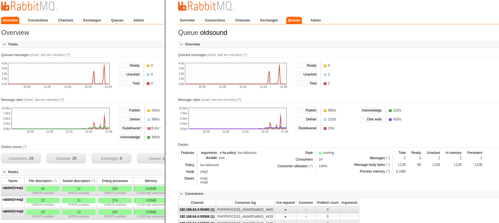

## Tests/Benckmark

### Node failures

#### Stop the first node

```
$ make stop-node-1
== Stop rabbitmq node 1 from cluster ==
rmq_rmq1_1
```

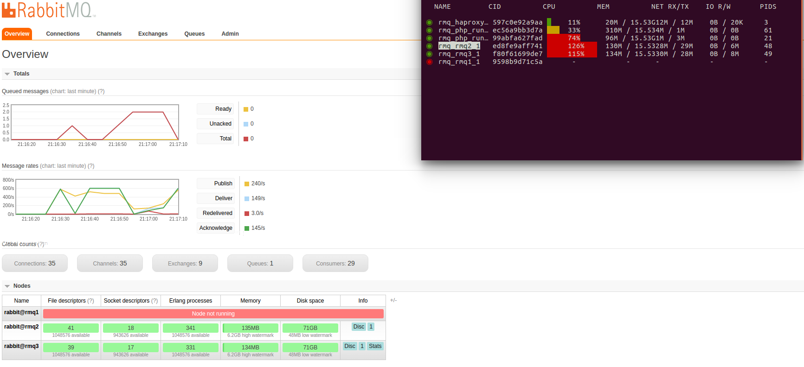

#### Stop the second node

```
$ make stop-node-2 
== Stop rabbitmq node 2 from cluster ==
rmq_rmq2_1
```

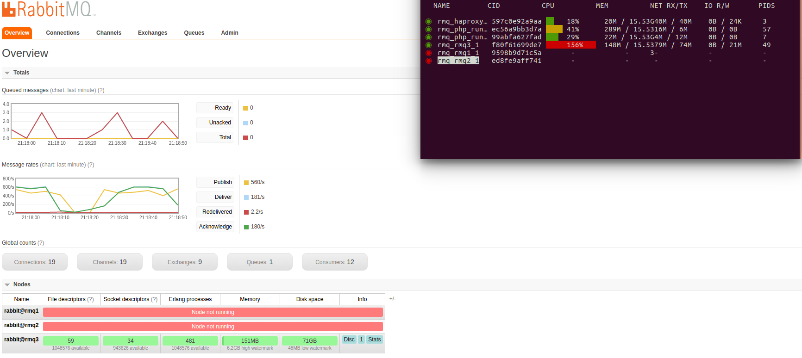

#### Restart the first node

```
$ make resume-node-1
== Stop rabbitmq node 1 from cluster ==
rmq_rmq1_1
```

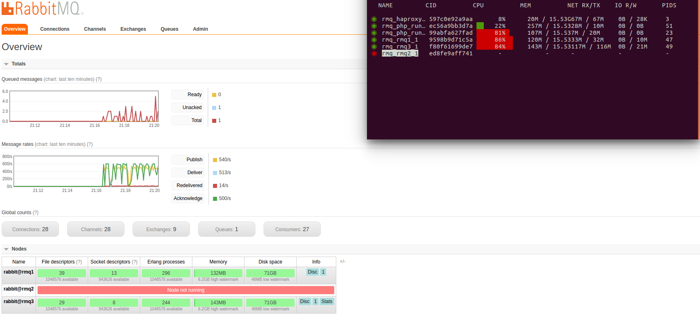

#### Restart all nodes

```
$ make start
== Start App ==
rmq_rmq1_1 is up-to-date
Starting rmq_rmq2_1
Starting rmq_rmq3_1
rmq_haproxy_1 is up-to-date
```

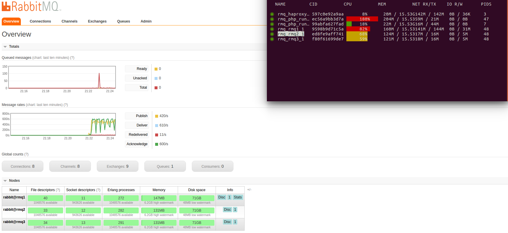

### Network partition


#### Exclude node 1 from the network cluster

```
$ make exclude-node-1
== Exclude rabbitmq node 1 from cluster ==
```

#### Restore node 1 in the network cluster

```
$ make restore-node-1 
== Exclude rabbit node 1 from cluster ==
```

**Partition between node 1 and node 2 and 3...**


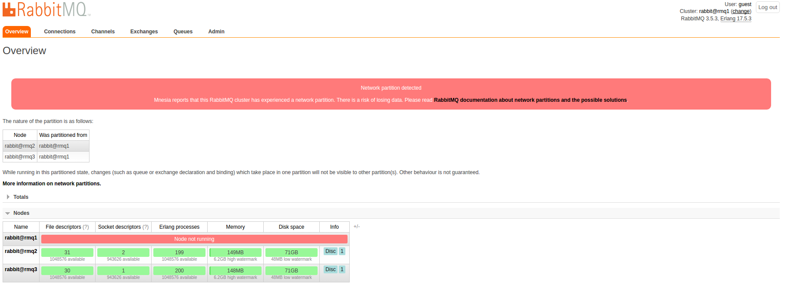

**...but all nodes are still running**

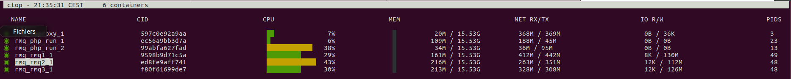


[https://www.rabbitmq.com/partitions.html](https://www.rabbitmq.com/partitions.html)

## TODO

* Tests
* More documentation.

## License

Copyright 2017 ypereirareis

Licensed under the Apache License, Version 2.0 (the "License");
you may not use this file except in compliance with the License.
You may obtain a copy of the License at

 http://www.apache.org/licenses/LICENSE-2.0

Unless required by applicable law or agreed to in writing, software
distributed under the License is distributed on an "AS IS" BASIS,
WITHOUT WARRANTIES OR CONDITIONS OF ANY KIND, either express or implied.
See the License for the specific language governing permissions and
limitations under the License.