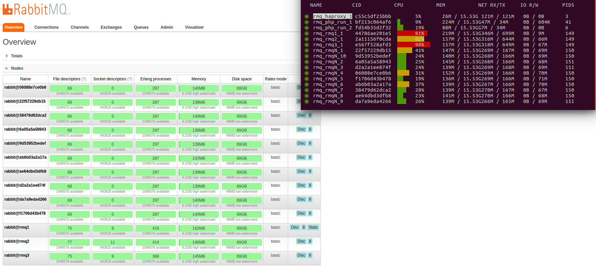

# Big cluster

You can easily create a lot of nodes in your cluster.

```
make add-more-nodes
```




[Go to Index](../README.md#documentation)  

[Setup](./SETUP.md)  
[Swarrot/SwarrotBundle](./SWARROT.md)  
[OldSound/RabbitMqBundle](./OLDSOUND.md)  
[Node failures](./FAILURE.md)  
[Network partition](./PARTITION.md)  
[Big cluster](./BIG.md)  
